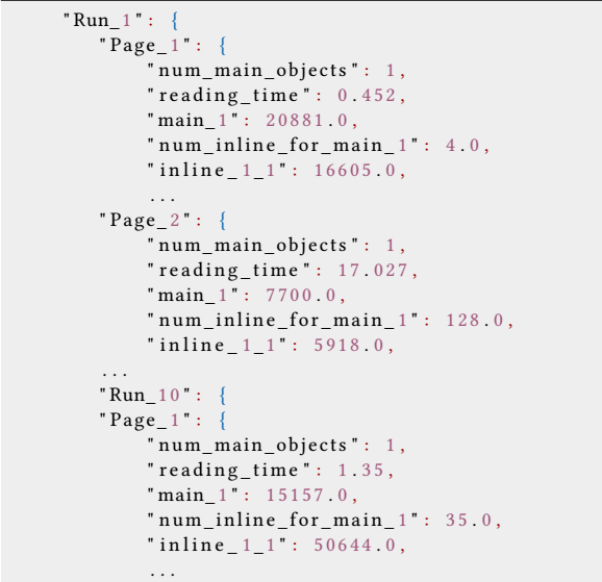

# SPEED
SPEED (a Scalable Python wEb bEhavioural moDel) is an emulation tool for web traffic. SPEED mimics both traffic patterns and user behaviour of modern web browsers. It scales well by focusing on traffic exchange without performing demanding application level user interface functions.

Authors: Darijo Raca <draca@etf.unsa.ba>, Ahmed H. Zahran <a.zahran@cs.ucc.ie>.


Contents:

- [Requirements](#requirements)
- [Installation](#installation)
- [Usage](#usage)
- [Logging](#logging)
- [Caveats](#caveats)
- [Acknowledgements](#acknowledgements)


## Requirements

- Python 3.6 or higher
- aiohttp library (https://docs.aiohttp.org/en/stable/)
- numpy library (https://numpy.org/)
- scipy library (https://scipy.org/)
- waitress library (https://docs.pylonsproject.org/projects/waitress/en/latest/)
- Flask (https://flask.palletsprojects.com/en/2.1.x/)

## Installation

Clone the repository
	git clone https://github.com/darijo/SPEED.git
	
Install Dependencies
   	
   	pip install Flask
   	pip install waitress
   	pip install aiohttp
   	pip install numpy
   	pip install scipy
   
   
## Usage

### Generate JSON and dummy web content

JSON files are created per user, containing all the information about each webpage, i.e., number of main and inline objects, size (in bytes) of each object. Also, this file stores information about user 
	behaviour for each webpage, reading or dwell time (i.e., how much time user spends "reading" the content). Figure shows the example of JSON file structure.

<p align="center">

</p>


   	python speed_web_generator.py --save_content Content/ --save_json Data/ --numClients 5 --numRuns 5 --webPages 10
     
Command creates 10 webpages per client (five clients), for five runs (in total 50 webpages per client). Data is saved in Content folder, while JSON file are saved in Data folder.
   
   	--save_content	location where to save web content
   
   	--save_json	location where to save JSON files
   
   	--numClients	number of clients (a separate JSON file is generated for each client)
   
   	--numRuns	the number of planned runs to generate random page sequences for subsequent runs
   
   	--webPages	number of webpages per client
   
### Run server

	waitress-serve --listen=127.0.0.1:8088 --call 'flaskr:create_app'
   
Command will listen on localhost and port 8088. Note that command expects script for flask (provided in flask folder)


### Run Client
	python speed_web_client.py -rn 1 --file Data/HTTP_Client_1_R5_W10.json  -sip http://127.0.0.1:8088/page --out_path results/plt_C1_R1.log
	
Command runs web client based on the file HTTP_Client_1_R5_W10.json and sends requests to server listening on 127.0.0.1:8088/page. Results (log) is saved to results/plt_C1_R1.log

	-rn	run identifier
   
   	--file	location of JSON file for the client
   
   	-sip	IP address of the server storing web content
   
   	--out_path	location where to save log files

## Logging

After client finishes donwloading web page, statistics will be saved to file with template `plt_C%_R%.log`, where C denotes client ID, and R denotes run ID.

Example

	INFO - 1649596603.091179 -retrieve_page - 72 - 239583 - PLT main object_1: 5
    INFO - 1649596603.169425 -retrieve_page - 72 - 239583 - PLT main object_2: 83
	INFO - 1649596603.206722 -retrieve_page - 82 - 239583 - PLT Page_1: 120 Reading Time: 25.460
	INFO - 1649596628.698372 -retrieve_page - 72 - 239583 - PLT main object_1: 6
	INFO - 1649596628.727034 -retrieve_page - 72 - 239583 - PLT main object_2: 34
	INFO - 1649596628.810912 -retrieve_page - 82 - 239583 - PLT Page_2: 118 Reading Time: 0.034

## Caveats

Path to folder with web content needs to be setup in ```__init__.py``` of flask folder. 

The line
 
	STATIC_FILE_DIR = os.path.join(str(os.getcwd()), "Content/")

needs to be set with correct path to web content (**Content** folder in our examples when creating dummy web pages)


   


	
